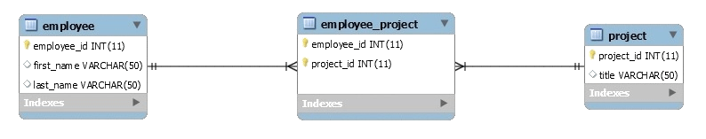

# Many To Many 
* In this scenario, any given employee can be assigned to multiple projects and a project may have multiple employees working for it, leading to a many-to-many association between the two.

# DB Set-up
* so its safe to assuem we have a created a db that already has the name spring 

##
            CREATE TABLE `employee` (
        `employee_id` int(11) NOT NULL AUTO_INCREMENT,
        `first_name` varchar(50) DEFAULT NULL,
        `last_name` varchar(50) DEFAULT NULL,
        PRIMARY KEY (`employee_id`)
        ) ENGINE=InnoDB AUTO_INCREMENT=17 DEFAULT CHARSET=utf8;

        CREATE TABLE `project` (
        `project_id` int(11) NOT NULL AUTO_INCREMENT,
        `title` varchar(50) DEFAULT NULL,
        PRIMARY KEY (`project_id`)
        ) ENGINE=InnoDB AUTO_INCREMENT=18 DEFAULT CHARSET=utf8;

        CREATE TABLE `employee_project` (
        `employee_id` int(11) NOT NULL,
        `project_id` int(11) NOT NULL,
        PRIMARY KEY (`employee_id`,`project_id`),
        KEY `project_id` (`project_id`),
        CONSTRAINT `employee_project_ibfk_1` 
        FOREIGN KEY (`employee_id`) REFERENCES `employee` (`employee_id`),
        CONSTRAINT `employee_project_ibfk_2` 
        FOREIGN KEY (`project_id`) REFERENCES `project` (`project_id`)
        ) ENGINE=InnoDB DEFAULT CHARSET=utf8;

##

# Model Classes

* The model classes Employee and Project need to be created with <strong> JPA annotations </strong>:

##
    @Entity
    @Table(name = "Employee")
    public class Employee { 
        // ...
    
        @ManyToMany(cascade = { CascadeType.ALL })
        @JoinTable(
            name = "Employee_Project", 
            joinColumns = { @JoinColumn(name = "employee_id") }, 
            inverseJoinColumns = { @JoinColumn(name = "project_id") }
        )
        Set<Project> projects = new HashSet<>();
    
        // standard constructor/getters/setters
    }
    @Entity
    @Table(name = "Project")
    public class Project {    
        // ...  
    
        @ManyToMany(mappedBy = "projects")
        private Set<Employee> employees = new HashSet<>();
        
        // standard constructors/getters/setters   
    }

##

# Test:

##
            public class HibernateManyToManyAnnotationMainIntegrationTest {
            private static SessionFactory sessionFactory;
            private Session session;

            // ...

            @Test
            public void givenData_whenInsert_thenCreatesMtoMrelationship() {
                String[] employeeData = { "Peter Oven", "Allan Norman" };
                String[] projectData = { "IT Project", "Networking Project" };
                Set<Project> projects = new HashSet<>();

                for (String proj : projectData) {
                    projects.add(new Project(proj));
                }

                for (String emp : employeeData) {
                    Employee employee = new Employee(emp.split(" ")[0], 
                    emp.split(" ")[1]);
        
                    assertEquals(0, employee.getProjects().size());
                    employee.setProjects(projects);
                    session.persist(employee);
        
                    assertNotNull(employee);
                }
            }

            @Test
            public void givenSession_whenRead_thenReturnsMtoMdata() {
                @SuppressWarnings("unchecked")
                List<Employee> employeeList = session.createQuery("FROM Employee")
                .list();
        
                assertNotNull(employeeList);
        
                for(Employee employee : employeeList) {
                    assertNotNull(employee.getProjects());
                }
            }

            // ...
        }
##